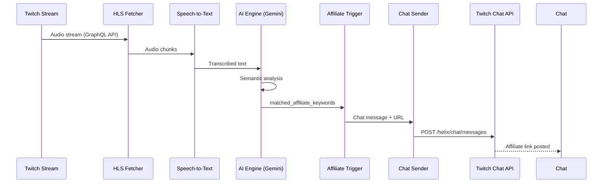

# Affiliate Link Injection

This document describes the affiliate link injection feature that automatically posts affiliate links to Twitch chat when the streamer mentions products.

## Overview

When a streamer mentions a product during their live stream, the AI detects the mention and posts a relevant affiliate link to chat. This helps streamers monetize product recommendations naturally.

## Architecture Flow



## Detection Process

Detection is **AI/LLM-based semantic analysis**, not exact keyword matching.

The AI Engine (Gemini) receives:

1. Transcribed text from the stream
2. User's configured affiliate keywords as context

The AI identifies product mentions related to keywords. Example:

- Keyword: `razer`
- Streamer says: "This Deathadder is my favorite mouse"
- AI recognizes Deathadder as a Razer product → triggers affiliate

## Message Format

All affiliate messages include FTC-required disclosure:

```
Affiliate Link 🔗 {product_name}: {url}
```

## Cooldown Policy

To prevent spam and maintain chat quality:

| Setting              | Value       | Rationale                                  |
| -------------------- | ----------- | ------------------------------------------ |
| Per-product cooldown | 5 minutes   | Prevents repeated mentions of same product |
| Per-stream global    | 10 msg/hour | Prevents excessive affiliate posts         |

## User Settings

| Setting          | Default | Description                                   |
| ---------------- | ------- | --------------------------------------------- |
| Auto-send        | ✅ ON   | Automatically post affiliate links            |
| Require approval | ❌ OFF  | If enabled, creates draft for manual approval |

Users can toggle between auto-send and approval-required in Settings.

## Rate Limits

Twitch enforces **per-account, per-channel** rate limits:

| Account Type | Limit        |
| ------------ | ------------ |
| Regular      | 20 msg/30s   |
| Mod/VIP      | 100 msg/30s  |
| Verified Bot | 7500 msg/30s |

Each ViralCue user uses their own OAuth token, so rate limits are isolated per user.

## Error Handling

| Error Type       | Action                 |
| ---------------- | ---------------------- |
| Rate limited     | Drop message           |
| Token expired    | Refresh and retry once |
| Network error    | Drop message           |
| Invalid response | Drop message           |

Non-recoverable errors result in dropped messages to prevent queue buildup.

## Required OAuth Scopes

When connecting Twitch, users must grant:

| Scope             | Purpose                              |
| ----------------- | ------------------------------------ |
| `user:write:chat` | Send chat messages                   |
| `user:bot`        | Bot account identification           |
| `channel:bot`     | Channel access (or moderator status) |

## Database Schema

### AffiliateLink Model

```prisma
model AffiliateLink {
  id              String    @id @default(uuid())
  userId          String
  productName     String
  keywords        String[]  // Trigger keywords for AI
  affiliateUrl    String
  platform        String?   // amazon, shopify, etc.
  commissionRate  Decimal?
  isActive        Boolean   @default(true)
  clickCount      Int       @default(0)
}
```

## API Endpoints

| Method | Endpoint                   | Description       |
| ------ | -------------------------- | ----------------- |
| GET    | `/api/affiliate-links`     | List user's links |
| POST   | `/api/affiliate-links`     | Create new link   |
| PUT    | `/api/affiliate-links/:id` | Update link       |
| DELETE | `/api/affiliate-links/:id` | Delete link       |

## Future: Kick Support

Kick integration is planned using:

- OAuth 2.0 + PKCE authentication
- WebSocket-based chat via `kick-js`
- Similar cooldown and disclosure policies
