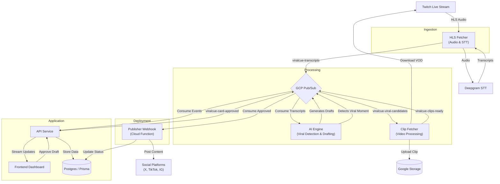

# System Data Flow Walkthrough

This document outlines the end-to-end data flow of ViralCue, from a live Twitch stream to a published social media post.

## High-Level Architecture

## Step-by-Step Process

### 1. Ingestion (HLS Fetcher)

The `hls-fetcher` service is responsible for ingesting live audio and converting it to text.

- **Input**: Live Twitch HLS stream.
- **Process**:
  - Extracts audio from TS segments.
  - Streams audio to **Deepgram** for real-time Speech-to-Text (STT).
  - Buffers transcripts.
- **Output**: Publishes transcript chunks to `viralcue-transcripts` (Pub/Sub).

### 2. Analysis & Detection (AI Engine)

The `ai-engine` service acts as the brain of the operation, replacing the legacy "Sentinel" service.

- **Trigger**: New transcript messages.
- **Process**:
  - Maintains a rolling 60s context window.
  - Checks for **Voice Commands** (e.g., "Clip that", "Save this").
  - Uses LLM (Bedrock/Vertex) to analyze content for "Viral Score" and context.
- **Decision**:
  - **If Viral (Score > 0.7) OR Voice Command**:
    - Calculates timestamp window (e.g., -70s to +15s).
    - Publishes `viralcue-viral-candidates` event.
  - **Draft Generation**:
    - Generates a social media draft (Caption, Hashtags).
    - Publishes `viralcue-drafts` event (or saves to DB via API).

### 3. Video Processing (Clip Fetcher)

The `clip-fetcher` service (Cloud Run Job) handles the heavy lifting of video manipulation.

- **Trigger**: `viralcue-viral-candidates` event.
- **Process**:
  - Connects to Twitch API to find the VOD for the stream.
  - Downloads the specific time range corresponding to the viral moment.
  - **Transcoding**: Converts to **9:16 Vertical Format** (1080x1920) for Shorts/Reels.
    - If source is 16:9, applies a blurred background fill.
  - Uploads the processed MP4 and Thumbnail to Google Cloud Storage (GCS).
- **Output**: Publishes `viralcue-clips-ready`.

### 4. Review (Dashboard)

The Frontend Dashboard allows the user to review and approve generated content.

- **Data Flow**: `API Service` consumes `viralcue-drafts` and `viralcue-clips-ready` -> Pushes to Frontend via WebSockets.
- **UI**: User sees a "Swipe Card" interface.
  - **Video**: Preview of the generated clip.
  - **Caption**: LLM-generated text.
  - **Action**: User modifies caption, toggles platforms (TikTok/X/IG), and clicks **Approve**.

### 5. Publishing (Publisher Webhook)

The final step is posting the content to social platforms.

- **Trigger**: `viralcue-card-approved` event.
- **Service**: `functions/publisher-webhook` (Python Cloud Function).
- **Process**:
  - **Caption Preparation**:
    - **Smart Truncation**: Truncates text to fit platform limits (e.g., 280 for X, 150 for TikTok).
    - **Watermarking**: Appends `🎬 Clipped by ViralCue AI` for Free Tier users.
    - **Stream Links**: Appends live stream URL if configured.
  - **Upload**: Posts video and text to configured platforms (TikTok, Instagram, Twitter/X, YouTube Shorts).
- **Output**: Updates database status to `published`.

## Infrastructure Notes

- **Database**: Postgres (managed via Prisma) stores Users, Sessions, Subscriptions, and Drafts.
- **Messaging**: Google Cloud Pub/Sub handles all inter-service communication.
- **Storage**: GCS is used for temporary raw clips and permanent processed/transcoded clips.
