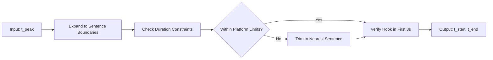
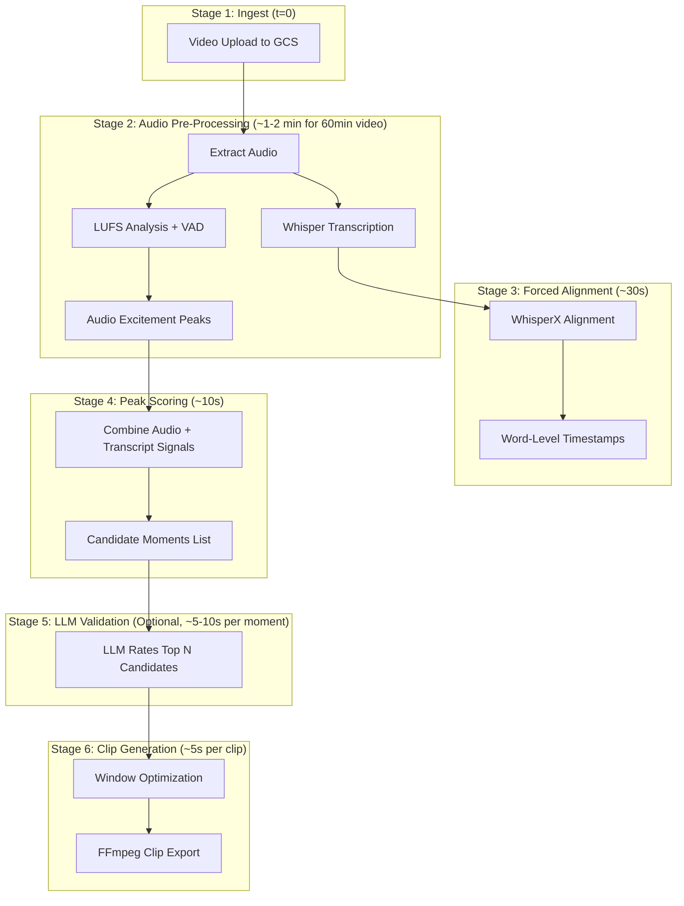

# Research Findings: Deterministic Viral Moment Detection & Clip Window Optimization

## Executive Summary

This report investigates deterministic methods for identifying "viral moments" in video content and optimizing clip window timing. The goal is to supplement or reduce reliance on LLM ratings by incorporating measurable audio, visual, and structural signals. We also analyze competitor approaches and provide timing estimates for a processing pipeline.

---

## Part 1: Deterministic Signals for Viral Moment Detection

### 1.1 Audio Signals

Audio analysis provides highly effective, measurable proxies for engagement-worthy moments.

| Signal                      | Description                                                                                             | Library/Tool           | Latency       |
| --------------------------- | ------------------------------------------------------------------------------------------------------- | ---------------------- | ------------- |
| **Loudness (LUFS)**         | Spikes in perceived loudness often correlate with exciting moments (cheers, laughter, emphatic speech). | `pyloudnorm`, `ffmpeg` | ~0.01x RTF    |
| **Laughter Detection**      | ML models (CNN/DNN) detect distinct laughter. ResNet-based models work well in noisy environments.      | Custom CNN, `PyTorch`  | ~0.1-0.5x RTF |
| **Speech Energy/Intensity** | High energy or rapid speech tempo indicates excitement/passion.                                         | `librosa` (RMS energy) | ~0.01x RTF    |
| **Silence Removal**         | Long silences are negative signals; remove or penalize them.                                            | VAD (`silero-vad`)     | ~0.01x RTF    |

**Algorithm Concept: Audio Excitement Score**

```
For each 1-second window:
  1. Calculate LUFS (normalize to baseline)
  2. Detect laughter probability (0-1)
  3. Calculate RMS energy spike vs. rolling average
  4. Combine: score = (w1 * loudness_delta) + (w2 * laughter_prob) + (w3 * energy_spike)
```

### 1.2 Visual Signals

Visual analysis adds context but is computationally heavier than audio.

| Signal                            | Description                                               | Library/Tool                 | Latency             |
| --------------------------------- | --------------------------------------------------------- | ---------------------------- | ------------------- |
| **Scene Change Frequency**        | Rapid cuts = high-paced, engaging (e.g., action montage). | `PySceneDetect`, `ffmpeg`    | ~17s per 2min video |
| **Motion Density (Optical Flow)** | High motion = action/energy.                              | `OpenCV` optical flow        | ~0.5-1x RTF         |
| **Face Detection + Emotion**      | Close-up of expressive faces = emotional connection.      | `DeepFace`, `FER`            | ~0.5-2x RTF         |
| **Object Detection (Gaming)**     | Game-specific events (kills, wins).                       | Custom YOLO, `Eklipse`-style | Varies              |

> [!NOTE]
> Visual signals are best used as secondary layer _after_ audio pre-filtering to reduce compute.

### 1.3 Text/Transcript Signals

Transcript-based analysis provides semantic understanding.

| Signal               | Description                                            | Library/Tool                     | Latency                      |
| -------------------- | ------------------------------------------------------ | -------------------------------- | ---------------------------- |
| **Keyword Density**  | Trending words, controversial topics, call-to-actions. | NLP regex, `spaCy`               | Negligible (post-transcript) |
| **Sentiment Spikes** | Strong positive/negative sentiment = emotional moment. | `transformers` (sentiment model) | ~0.1x RTF                    |
| **Named Entities**   | Mentions of famous people, brands, current events.     | `spaCy` NER                      | Negligible                   |

### 1.4 Engagement Proxies (Heuristics)

Without actual viewer retention data, use heuristic proxies:

| Proxy                     | Rationale                                                      |
| ------------------------- | -------------------------------------------------------------- |
| **"Hook-within-3s" Rule** | If first 3s have low energy/score, penalize clip               |
| **Content Density**       | Words per minute \* loudness variation = density score         |
| **Question Detection**    | Rhetorical questions engage viewers (detection via transcript) |

---

## Part 2: Clip Window Timing Optimization

### 2.1 Sentence Boundary Detection

Cutting at natural speech boundaries (not mid-word/sentence) is critical for clip quality.

**Recommended Pipeline: WhisperX**

1. **Transcribe**: Whisper generates segments with approximate timestamps
2. **Forced Alignment**: WAV2VEC2 aligns words to exact timestamps (~10-50ms accuracy)
3. **Sentence Grouping**: Aggregate words into sentences using punctuation/pauses

| Tool                 | Function                         | Processing Speed     |
| -------------------- | -------------------------------- | -------------------- |
| `whisper` (large-v3) | Transcription                    | ~25-70x RTF (GPU)    |
| `WhisperX`           | Transcription + Forced Alignment | ~50-70x RTF (GPU)    |
| `faster-whisper`     | Optimized Whisper                | ~4x faster than base |
| `silero-vad`         | Voice Activity Detection         | ~0.01x RTF           |

**Key Insight**: Whisper processes in 30-second chunks. For a 60-minute video, expect:

- ~60 min / 50x RTF ≈ **~1.2 minutes** of transcription time (GPU)
- CPU-only: ~15-30 minutes

### 2.2 Smart Clip Windowing Algorithm

**Goal**: Given a "viral moment" timestamp `t_peak`, find optimal `[t_start, t_end]`.



**Algorithm Steps**:

1. **Locate Peak Sentence**: Find sentence containing `t_peak`
2. **Expand Context**: Include 1-2 sentences before (setup) and 1-2 after (resolution)
3. **Apply Duration Constraints**:
   - TikTok: 15-60s optimal (21-34s sweet spot)
   - Reels: 7-30s optimal
   - Shorts: 15-45s optimal (max 60s)
4. **Trim at Sentence Boundaries**: If over duration, trim to nearest sentence end
5. **Verify Hook**: First 3 seconds must have above-threshold excitement score
6. **Optional Padding**: Add 0.5-1s buffer before first word (for B-roll overlay)

### 2.3 Platform-Specific Duration Guidelines

| Platform   | Optimal Duration | Max Duration | Key Metric                     |
| ---------- | ---------------- | ------------ | ------------------------------ |
| **TikTok** | 21-34s           | 10 min       | Completion rate, replays       |
| **Reels**  | 7-30s            | 90s (in-app) | Completion rate                |
| **Shorts** | 15-45s           | 60s          | Avg view duration (goal: 80%+) |

> [!IMPORTANT]
> For clips under 30s, aim for ~100% completion rate metrics. For 30-60s, 80% average view duration is acceptable.

---

## Part 3: Competitor Analysis

### 3.1 Opus Clip

**Key Technology**:

1. Whisper transcription → ChatGPT segment understanding
2. AI identifies "gold nuggets" (high-impact moments)
3. Face detection for speaker tracking
4. Auto-captions with animated keywords
5. **Virality Score**: ML model trained on thousands of viral videos

**Pipeline**:

```
Video → Whisper → LLM (GPT) for segment scoring → Face detection → ffmpeg render
```

### 3.2 Eklipse (Gaming Focus)

**Key Technology**:

1. Real-time stream analysis
2. **Object Detection + OCR**: Reads kill feeds, game UI elements
3. Trained on 1,000+ games for event detection
4. Voice command ("Clip it!") for instant capture

**Unique Aspect**: Domain-specific visual ML models for gaming events.

### 3.3 Dumme (Podcast/Speech Focus)

**Key Technology**:

1. Transcription + semantic understanding
2. Emotion decoding + speaker tracking
3. Optimizes for hook + narrative arc + natural ending
4. Auto-generated titles/descriptions

**Unique Aspect**: Context preservation for speech-heavy content.

### 3.4 Common Patterns Across Competitors

| Stage                 | Common Approach                                       |
| --------------------- | ----------------------------------------------------- |
| **Transcription**     | Whisper or equivalent ASR                             |
| **Segmentation**      | LLM or custom ML for identifying interesting segments |
| **Visual Processing** | Face detection, speaker tracking                      |
| **Rendering**         | FFmpeg with 9:16 cropping, auto-captions              |
| **Scoring**           | ML-based "virality" or "interest" score               |

> [!TIP]
> Competitors use LLMs for semantic scoring but rely on **deterministic pre-filtering** (loudness, scene changes, VAD) to reduce the segments sent to expensive LLM calls.

---

## Part 4: Processing Pipeline & Timing Estimates

### 4.1 Proposed Hybrid Pipeline



### 4.2 Timing Estimates (60-minute source video, GPU)

| Stage                          | Processing Time  | Notes                       |
| ------------------------------ | ---------------- | --------------------------- |
| Audio Extraction               | ~5s              | FFmpeg                      |
| Whisper large-v3               | ~60-90s          | 50-70x RTF                  |
| LUFS Analysis                  | ~5s              | Parallel with transcription |
| Forced Alignment               | ~30s             | WhisperX                    |
| Audio Peak Detection           | ~5s              | Simple signal processing    |
| Candidate Scoring              | ~10s             | Vectorized numpy operations |
| LLM Validation (10 candidates) | ~30s             | API call parallelization    |
| Clip Rendering (10 clips)      | ~50s             | 5s per clip                 |
| **Total**                      | **~3-4 minutes** | End-to-end                  |

### 4.3 Timeline: Moment Detection → Draft Ready

```
t = 0:00       Video ingestion starts
t = 0:05       Audio extracted
t = 1:30       Transcription + LUFS complete (parallel)
t = 2:00       Forced alignment + peak detection complete
t = 2:10       Candidate moments identified
t = 2:40       LLM validation complete
t = 3:30       All clips rendered
t = 3:35       Drafts pushed to user dashboard
```

**Summary**: For a 60-minute video, expect **~3-4 minutes** from upload to drafts ready.

> [!WARNING]
> CPU-only processing will be 10-25x slower. For production, GPU instances (e.g., Cloud Run with GPU, or dedicated VM) are essential.

---

## Part 5: Implementation Recommendations

### 5.1 Deterministic Pre-Filtering (High Priority)

Implement these _before_ any LLM calls:

1. **Audio Excitement Score**: LUFS + RMS energy + optional laughter detection
2. **VAD Filtering**: Automatic silence removal from consideration
3. **Transcript Keyword Matching**: Flag moments with trending/emotional words

This reduces LLM calls by 80-90% while maintaining quality.

### 5.2 Smart Windowing (High Priority)

1. Integrate **WhisperX** for forced alignment
2. Implement sentence boundary detection
3. Apply platform-specific duration constraints
4. Ensure clips start after natural pauses (not mid-sentence)

### 5.3 Visual Analysis (Lower Priority, Higher Compute)

Only for specific use cases (gaming, tutorials):

1. Scene change detection for pacing analysis
2. Face detection for speaker framing
3. Motion analysis for "action" moments

### 5.4 Recommended Tech Stack

| Component       | Recommended Tool         | Alternative           |
| --------------- | ------------------------ | --------------------- |
| Transcription   | `faster-whisper`         | OpenAI API            |
| Alignment       | `WhisperX`               | `whisper-timestamped` |
| VAD             | `silero-vad`             | `webrtcvad`           |
| Audio Analysis  | `librosa` + `pyloudnorm` | `pyAudioAnalysis`     |
| Scene Detection | `PySceneDetect`          | FFmpeg scene filter   |
| Clip Rendering  | `FFmpeg`                 | `moviepy`             |

---

## Appendix: Platform Duration Cheat Sheet

| Platform | Hook Window | Sweet Spot | Max Before Penalty |
| -------- | ----------- | ---------- | ------------------ |
| TikTok   | 0-3s        | 21-34s     | 60s                |
| Reels    | 0-2s        | 15-30s     | 90s                |
| Shorts   | 0-3s        | 30-45s     | 60s                |

---

## References

- [Opus Clip Technology](https://opus.pro)
- [WhisperX Paper](https://arxiv.org/abs/2303.00747)
- [PySceneDetect Documentation](https://scenedetect.com)
- [pyloudnorm GitHub](https://github.com/csteinmetz1/pyloudnorm)
- Platform optimization guides from Buffer, SocialInsider, Opus.pro

---

## Part 6: Intelligent Auto-Framing & Layouts (GCP Native Strategy)

In response to the requirement for a GCP-first stack, we recommend a composite architecture leveraging **Google Cloud Video Intelligence API** and **Vertex AI**.

### 6.1 The "GCP-Native" Approach to Active Speaker Detection (ASD)

GCP does not offer a single "Active Speaker Detection" API. Instead, we must **fuse** outputs from two powerful APIs:

*   **Visual Tracking**: `GCP Video Intelligence API` (Object Tracking & Face Detection)
*   **Audio Diarization**: `GCP Speech-to-Text API` (Speaker Diarization)

**The Fusion Logic (Deterministic Algorithm):**
1.  **Ingest**: Video is processed by both APIs in parallel.
2.  **Visual Stream**: Video Intelligence API returns `Person` and `Face` objects with **Bounding Boxes** for every frame (e.g., `Person A: [x, y, w, h] @ t=0.5s`).
3.  **Audio Stream**: Speech-to-Text returns **Speaker Tags** with strictly timed segments (e.g., `Speaker 1: "Hello world" @ t=0.5s-1.5s`).
4.  **Correlation Engine**:
    - Query: "At t=1.0s, who is speaking?" -> `Speaker 1`.
    - Query: "At t=1.0s, which faces are visible?" -> `Face X`, `Face Y`.
    - **Heuristic Matching**:
        - *Single Face*: If only Face X is visible, Frame = Face X.
        - *Multi-Face*: If Face X and Face Y are visible, apply **"Dominant Movement"** heuristic (active talkers move heads/lips more) or simply default to a *Split Screen* or *Wide Shot*.

### 6.2 Handling Common Scenarios

#### Scenario A: The Single Streamer (Reaction Videos)
**Challenge**: Streamer is in a corner (facecam), content is fullscreen.
**GCP Solution**:
- Use **Face Detection** to identify the permanent bounds of the "Facecam".
- **Dynamic Layout**:
    - **Base Layer**: Gameplay/Content (cropped to remove facecam if needed).
    - **Overlay Layer**: The Facecam (extracted via bounding box), scaled and positioned elegantly (e.g., circular crop, or distinct border).
    - **Background**: Blurred version of gameplay to fill 9:16 aspect ratio gaps.

#### Scenario B: Multi-Subject / Podcast
**Challenge**: Two people talking, overlapping.
**GCP Solution**:
- **Speaker Diarization** is key here.
- **State Machine**:
    - State: `Speaker A talking` -> **Crop to Person A**.
    - State: `Speaker B talking` -> **Crop to Person B**.
    - State: `Both talking / Crosstalk` -> **Trigger Split-Screen (Vertical Stack)**.
    - State: `Silence` -> **Wide Shot (Both)**.

### 6.3 Deploying Custom Models on GCP
For higher precision (e.g., lip-sync verification to distinguishing active speakers in a crowd), standard APIs might fall short.
**Recommendation**: Deploy an open-source model like **TalkNet-ASD** on **Google Cloud Run** (with GPU) or **Vertex AI Prediction**.
- TalkNet is specialized for identifying *who* is speaking by correlating audio waveform with lip motion visual features.
- **Workflow**:
    1.  Pre-filter interesting clips with standard APIs.
    2.  Send *only* the specific clip candidates to the custom TalkNet endpoint for precise cropping coordinates.

### 6.4 Proposed Layout Generation Stack
Once bounding boxes are calculated, use **FFmpeg** (via Cloud Run) for the actual rendering.

| Layout Type | FFmpeg Filter Logic |
|-------------|---------------------|
| **Smart Crop** | `crop=w:h:x:y` (coordinates updated dynamically via `sendcmd` or segment chunking) |
| **Split Screen** | `hstack` or `vstack` filters to stack Person A and Person B. |
| **Blurred BG** | `split[a][b]; [a]scale=1080:1920,boxblur=20[bg]; [b]scale=1080:-1[fg]; [bg][fg]overlay` |

---

## Part 7: Updated Requirements Checklist

- [ ] **GCP Project**: Enable Video Intelligence API & Speech-to-Text API.
- [ ] **Infrastructure**: Cloud Run services for "Orchestrator" (Python) and "Renderer" (FFmpeg).
- [ ] **Storage**: GCS buckets for raw video, temp assets, and final renders.
- [ ] **Database**: Firestore to store metadata (Face ID -> Speaker ID mappings).
